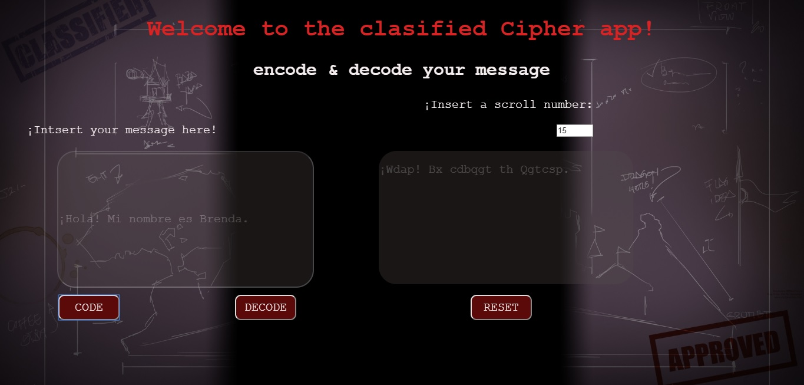
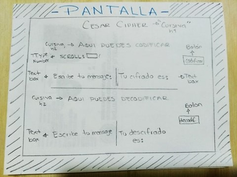

# Classified Cipher

## Índice

* [1. Introducción](#1-Introducción)
* [2. Resumen del Proyecto](#2-resumen-del-proyecto)
* [3. Resultado Final](#3-resultado-final)
* [4. Investigación UX](#4-investigacion-UX)

## 1. Introducción:

En criptografía, el cifrado César, también conocido como cifrado por desplazamiento, código de César o desplazamiento de César, es una de las técnicas decodificación más simples y más usadas. Es un tipo de cifrado por sustitución en el que una letra en el texto original es reemplazada por otra letra que se encuentra un número fijo de posiciones más adelante en el alfabeto. Por ejemplo, con un desplazamiento de 3, la A sería sustituida por la D (situada 3 lugares a la derecha de la A ), la B sería reemplazada por la E, etc. Este método debe su nombre, según Suetonio, a Julio César, que lo usaba para comunicarse con sus generales.

Aunque actualmente es fácil su criptoanálisis, en la época de Julio Cesar pocos eran los que sabían leer, y aún menos los que habrían podido hacer uso de técnicas de criptoanálisis.

Actualmente con las computadoras este roceso se ha vuelto más sencillo, ya que un programa puede hacerlo en cuestion de segundos y de manera correcta. Funciona de la siguiente manera:

Por ejemplo, si usamos un desplazamiento (_offset_) de 3 posiciones:

* La letra A se cifra como D.
* La palabra CASA se cifra como FDVD.
* Alfabeto sin cifrar: A B C D E F G H I J K L M N O P Q R S T U V W X Y Z
* Alfabeto cifrado: D E F G H I J K L M N O P Q R S T U V W X Y Z A B C

## 2. Resumen del Proyecto

Para este proyecto elegí el tema de _archivos clasificados_ que hay que codificar
y decodificar en una interfaz de archivos secretos. Codifica y decodifica letras mayúsculas,
minúsculas y los caracteres especiales como espacios, puntos, comas, signos, etc.
los pasa exactamente igual.

## 3. Resultado Final

## 4. Investigación UX

### Usuarios:

 El objetivo es darle a los usuarios una manera de ocultar sus mensajes o descifrarlos creando un ambiente "secreto" gracias a la interfaz, que sea sencillo de entender y utilizar.

### Solución de problemas/ necesidades:

- [x] Ocultar texto que el usuario no desea que otras personas "no autorizadas" conozcan
- [x] Descifrar un texto que alguien le haya compartido al usuario
- [x] La interfaz es sencilla de entender y utilizar.

### Primer Prototipo:

### Feedback:

 - [x] Alinear los botones.
- [x] Hacer más grandes los cuadros para el texto.
- [x] Poner colores acorde al tema.
- [x] Agregar boton de reset.
- [x] Cambiar la letra.

### Prototipo Final:

